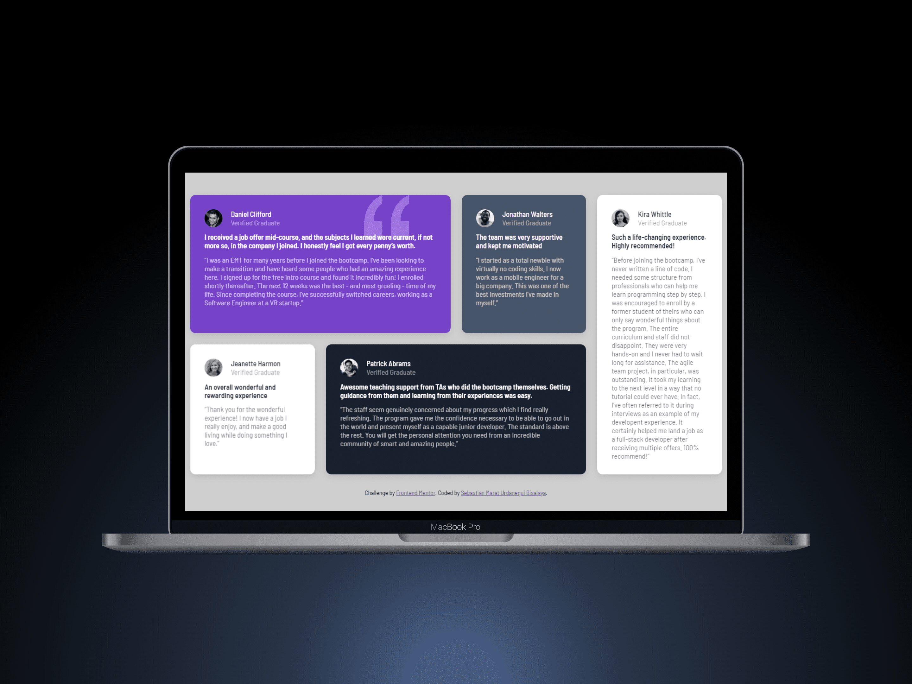

# Frontend Mentor - Testimonials grid section solution

This is a solution to the [Testimonials grid section challenge on Frontend Mentor](https://www.frontendmentor.io/challenges/testimonials-grid-section-Nnw6J7Un7). Frontend Mentor challenges help you improve your coding skills by building realistic projects. 

## Table of contents

- [Frontend Mentor - Testimonials grid section solution](#frontend-mentor---testimonials-grid-section-solution)
  - [Table of contents](#table-of-contents)
  - [Overview](#overview)
    - [The challenge](#the-challenge)
    - [Screenshot](#screenshot)
    - [Links](#links)
  - [My process](#my-process)
    - [Built with](#built-with)
    - [What I learned](#what-i-learned)
  - [Author](#author)

## Overview

### The challenge

Users should be able to:

- View the optimal layout for the site depending on their device's screen size

### Screenshot



### Links

- Solution URL: [Add solution URL here](https://www.frontendmentor.io/solutions/responsive-testimonial-section-using-css-grid-3HgOB5Il6x)
- Live Site URL: [Add live site URL here](https://responsive-testimonial-section-using-css-grid.vercel.app/)

## My process

### Built with

- Semantic HTML5 markup
- CSS custom properties
- Flexbox
- CSS Grid
- Mobile-first workflow

### What I learned

Use this section to recap over some of your major learnings while working through this project.

The major learnings are Block-Element-Modifier (BEM) as one of the many CSS architecture and CSS Grid.

I consider CSS Grid to be one of the best techniques with which you can work with components that need adaptive screens. Obviously this is also possible if you use Flex, but in this case the task requires using Grid.

While working, I applied the BEM architecture to improve the order of the style code and make it easier to understand for the people who will join the work team.

To see how you can add code snippets, see below:

```html
<div class="testimonial">
    <div class="testimonial_card testimonial_first">
        <p>Testimonial 1</p>
    </div>
    <div class="testimonial_card testimonial_second">
        <p>Testimonial 2</p>
    </div>
</div>
```
```css
/* This is just an example to show what I learned while developing this project */

/* Apply Mobile-first */
.testimonial {
    display: grid;
    grid-template-columns: 1fr
}
.testimonial_card {
    display: flex;
    justify-content: center;
    align-items: center;
    background-color: #f5b5bb;
    padding: 10px;
    margin: 10px;
}

/* Apply styles to tablet */
@media (width >= 768px) {
    .testimonial {
    display: grid;
    grid-template-columns: 1fr 1fr;
    grid-template-areas: 
    "first_container second_container";
    }
    .testimonial_first {
        grid-area: first_container
    };
    .testimonial_second {
        grid-area: second-container
    }
}
```


## Author

- Website - [Sebastian Marat Urdanegui Bisalaya](https://sebastianurdanegui.vercel.app/)
- LinkedIn - [@sebastianurdaneguibisalaya](https://www.linkedin.com/in/sebastianurdaneguibisalaya/)
